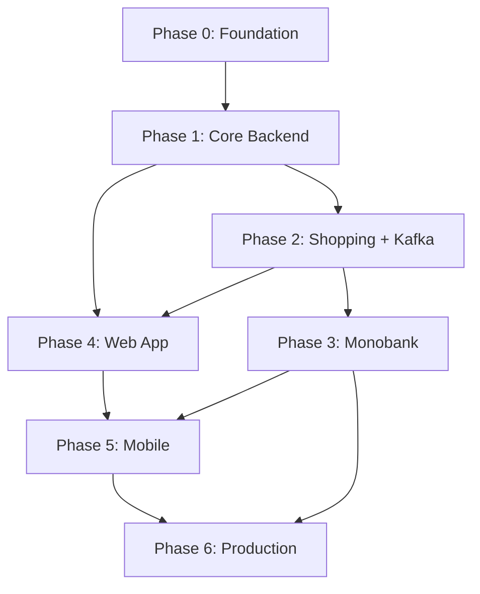

# Household — Development Plan

> A comprehensive app for tracking finances and shared shopping across a family / household.
> Project goal — deepening backend, microservices, and mobile development skills.

---

## Table of contents

1. [Vision and goals](#1-vision-and-goals)
2. [Tech stack](#2-tech-stack)
3. [Architecture](#3-architecture)
4. [Microservices](#4-microservices)
5. [Infrastructure (Docker Compose)](#5-infrastructure-docker-compose)
6. [Data model](#6-data-model)
7. [Kafka events](#7-kafka-events)
8. [API — all endpoints](#8-api--all-endpoints)
9. [Development phases](#9-development-phases)
10. [MVP scope](#10-mvp-scope)
11. [Deployment and App Store](#11-deployment-and-app-store)
11a. [2026-08 audits (completed)](#11a-2026-08-audits-completed)
12. [Open questions](#12-open-questions)
13. [Real-time (Socket.IO)](#13-real-time-socketio)

---

## 1. Vision and goals

### What the app does

| Module | Description |
|--------|-------------|
| **Finance** | Savings (cash, banks, crypto), income from various sources, expenses and subscriptions. Auto-sync with Monobank later. |
| **Shopping** | Lists per store, "where we usually buy" vs "buy now somewhere else", price history. |
| **Shared access** | Multiple users in one space: each contributes their data, sees the combined picture, invites others. |

### Why microservices

This is a **learning project**: the goal is to go through real complexity (inter-service communication, Kafka, Redis, separate databases, deployment). Architecture is **microservice-ready from day one**, but not 10 services in the MVP — see [section 4](#4-microservices).

### Development order

```
Backend → Web → Mobile → Integrations → Deployment → App Store
```

---

## 2. Tech stack

| Layer | Technology | Notes |
|-------|------------|-------|
| Backend | **NestJS + TypeScript** | Monorepo, `@nestjs/microservices` for Kafka |
| DB | **PostgreSQL** | Separate schema/DB per service (or schema-per-service) |
| Cache / sessions | **Redis** | Refresh tokens, rate limit, invite tokens, Socket.IO adapter |
| Queues | **Apache Kafka** | Inter-service events; bridge → Socket.IO for real-time |
| Real-time | **Socket.IO** | Collaborative editing, presence, live updates |
| Web | **React + Vite** | SPA behind login — SEO not needed |
| Mobile | **React Native** | Shared types/contracts with web via shared lib; `socket.io-client` |
| Containerisation | **Docker Compose** | Locally and as the basis for prod |
| API docs | **Swagger** | On the API Gateway |

### React vs Next.js

**Recommendation: React (Vite), not Next.js.**

- The app is behind auth — SEO is irrelevant.
- Simpler mental model: one SPA ≈ one RN client.
- Less server complexity while learning backend.
- Next.js makes sense later if a public landing/blog appears.

---

## 3. Architecture

```
┌──────────────────┐          ┌──────────────────┐
│    React Web     │          │  React Native    │
└────────┬─────────┘          └────────┬─────────┘
         │ HTTPS/REST                  │ HTTPS/REST
         │ WSS (Socket.IO)             │ WSS (Socket.IO)
         └────────────────┬────────────┘
                          │
             ┌────────────┴────────────┐
             │                         │
             ▼                         ▼
  ┌─────────────────────┐   ┌──────────────────────┐
  │    API Gateway      │   │  Realtime Gateway    │
  │  :3000 (REST)       │   │  :3010 (Socket.IO)   │
  │  auth guard, proxy  │   │  rooms, presence     │
  └──────────┬──────────┘   └──────────┬───────────┘
             │                         │
    ┌────────┼──────────┐    Redis Adapter (pub/sub)
    ▼        ▼          ▼              │
┌──────┐ ┌──────────┐ ┌─────────┐     │ Kafka Consumer
│ Auth │ │Household │ │ Finance │◄────┘
└──┬───┘ └────┬─────┘ └────┬────┘
   │          │             │
┌──────────┐  │   ┌─────────────┐  ┌──────────────┐
│ Shopping │  │   │ Integration │  │ Notification │
└────┬─────┘  │   └──────┬──────┘  └──────┬───────┘
     │        │           │                │
     └────────┴───────────┴────────────────┘
                          │
          ┌───────────────┼───────────────┐
          ▼               ▼               ▼
     PostgreSQL          Redis           Kafka
```

**Principles:**

- Clients hit REST **only** through the API Gateway.
- WebSocket connections go **only** through the Realtime Gateway (a separate service).
- Services communicate via **Kafka** (async) and **HTTP/gRPC** (sync, when an immediate response is required).
- Realtime Gateway **listens to Kafka** and forwards events to Socket.IO rooms — services never talk to clients directly.
- Almost every entity is scoped to `householdId` — multi-tenancy at the household level.
- Short-lived JWT access token + refresh token (in Redis).
- Horizontal scaling of Realtime Gateway via `@socket.io/redis-adapter`.

---

## 4. Microservices

### Naming the "family" concept in the product

| Option (UI) | Technical name | Pros |
|-------------|----------------|------|
| **Home** | `household` | Neutral, not limited to relatives |
| Family | `family` | Clear, but too narrow |
| Space | `space` | Trendy, but abstract |

**Recommendation:** in API and code — `household`; in UI — **"Home"** (or "Our home"). Support multiple households per user (e.g. own apartment + country house).

---

### 4.1 API Gateway

| Responsibility |
|----------------|
| Single REST API entry point |
| JWT validation, forwarding `userId` / `householdId` in headers |
| Rate limiting (Redis) |
| Routing to internal services |
| Swagger / OpenAPI |
| CORS, request logging |

---

### 4.2 Auth Service

| Responsibility |
|----------------|
| OAuth 2.0: Google, Apple, Facebook (all three strategies implemented; registration through `OAuthStrategyRegistry` — #85) |
| Email + password with mandatory 6-digit mailbox verification, Argon2id hashing (OWASP 2024 params), zxcvbn ≥ 3, HIBP breach check, per-account soft-lock after 5 failed attempts with single-use unlock link — #184; full spec in `docs/security/password-policy.md` |
| Authenticated password change (`POST /auth/password/change`) — reuses zxcvbn + HIBP + SAME_PASSWORD guards, revokes every other session on rotation, issues a fresh session for the calling device (#185) |
| JWT access (15 min) + refresh (30 days), algorithm on an allowlist (#52) |
| Refresh token in HttpOnly + Secure + SameSite=None cookie, paired CSRF double-submit cookie (#60, #61) |
| Login from multiple devices; `POST /auth/logout-all` invalidates all sessions for the user (#66) |
| Single-use sessions with atomic `GETDEL` in Redis (protects against race conditions on refresh — #55) |
| Sessions + rate limiting on auth endpoints (#54) |
| User profile (`displayName`, `avatarUrl` validated with `@IsUrl({protocols:['http','https']})`, `locale`) |
| Account deletion (GDPR-ready) |
| Audit log for logout-all and account deletion (`@Audit()` + `libs/audit` — #68.3) |

> **App Store:** if third-party social logins exist — **Sign in with Apple is mandatory** ([Guideline 4.8](https://developer.apple.com/app-store/review/guidelines/)).

> **Password login (implemented in #184 + #185):** Argon2id via
> `@node-rs/argon2`, zxcvbn ≥ 3, HIBP breach check (fail-open), per-account
> soft-lock with unlock link, authenticated password change with full
> session revocation. Full acceptance matrix in
> [`docs/security/password-policy.md`](security/password-policy.md).
> Web UI (#186) ships separately.

---

### 4.3 Household Service

| Responsibility |
|----------------|
| CRUD for households ("Home") |
| Members and roles (`MembersService` — extracted from HouseholdsService by SRP, #89) |
| Invites (`InvitesService` — also separated, #89); email / link / token in Redis + DB row; TTL 7 days; duplicate pending-invite guard (#68.7); email must match at accept time (#76) |
| `canGrant()` guard against peer-level elevation (admin cannot grant admin/owner — #65) |
| Switching the active household |
| Kafka consumer `auth.user.deleted` → cascade cleanup of memberships |
| Kafka emitter `household.deleted` → finance/shopping consumers clean up their schemas (#83.4) |
| Audit log for delete household, member role change, member remove, invite create/revoke/accept (#68.3) |

**Roles:**

| Role | Rights |
|------|--------|
| `owner` | Everything + delete household, transfer ownership |
| `admin` | Manage members, settings |
| `member` | CRUD their own and shared data |
| `viewer` | Read-only |

---

### 4.4 Finance Service

| Responsibility |
|----------------|
| Accounts: cash, bank, crypto, investment, deposit; manual balance adjustment `POST /accounts/:id/adjust-balance` creates an ADJUSTMENT transaction for history |
| Transactions: income, expense, transfer, adjustment; account balance is recomputed atomically via `SELECT ... FOR UPDATE` (#70) and SQL `SUM` for aggregation (#71); reverse-delta on delete/update (#69) |
| Transfer — paired transactions with an explicit `transferPairId`, deleted/updated as one unit (#74) |
| Categories: soft-delete (archive) → `GET /categories/:id/impact` reveals dependent entities → hard-delete only via `?permanent=true` when impact == 0 (#110–115) |
| Income sources (salary, project, dividends, rent…) |
| Recurring payments + `@nestjs/schedule` cron (#78); endpoint `GET /recurring-payments/upcoming` |
| Reports: monthly / by-category / net-worth (`ReportsService` uses `TransactionQueryRepository` — #87) |
| Kafka consumer `household.deleted` → full cleanup of the finance schema for that household (#83.4) |
| Audit log for delete account and delete transaction (#68.3) |
| All list endpoints are capped by `LIST_HARD_LIMIT=1000` (#68.2) |
| FX rates: 08:00 Kyiv cron pulls PrivatBank, stores in `exchange_rates`; `GET /rates/latest` for web multi-currency conversion; `GET /rates/history` — reserved for future dynamics charts |
| Mapping external transactions (from Integration) to manual ones |

---

### 4.5 Shopping Service

| Responsibility |
|----------------|
| Stores (supermarkets, greengrocer, pharmacy…) |
| Product catalog linked to stores; every `storeId` reference is household-scope-checked on create/update (#67) |
| Optional product `url` with server-side Open Graph/Twitter Card preview (`imageUrl`/`previewTitle`, cached — not re-fetched on read); SSRF-guarded via `assertPublicUrl` (`libs/common`, #197) |
| Shopping lists (active / completed / archived) |
| List items (`ShoppingListItemsService` — split out of ShoppingListsService by SRP, #91) |
| "Preferred store" vs "buy now elsewhere" |
| Kafka consumer `household.deleted` → cascade cleanup of stores/products/lists (items follow via FK cascade, #83.4) |
| Price history (optional in MVP+) |
| "Purchased" marker linked to a transaction (later) |

---

### 4.6 Integration Service

| Responsibility |
|----------------|
| Monobank: connection, statement sync, mapping to accounts |
| Webhook / polling honouring API limits |
| Sync logs |
| *Later:* crypto rates, other banks |

**Monobank limits** (must be baked into the design):

- Statement: up to **31 days + 1 hour** per request
- Frequency: **once per 60 seconds** per token
- → Incremental sync + Kafka queue

---

### 4.7 Notification Service

| Responsibility |
|----------------|
| Email: invites, sync failure |
| Push (FCM / APNs) — after mobile |
| In-app notifications (via Redis pub/sub or a dedicated table) |
| Recurring payment reminders |

*Can be deferred to Phase 3 — in MVP email through Auth/Household is enough.*

---

### 4.8 Realtime Gateway

| Responsibility |
|----------------|
| WebSocket server on top of Socket.IO (port 3010) |
| WS-connection auth via JWT (handshake `auth.token`) |
| Room management: `household:{householdId}` |
| Presence: who is online in the household |
| Editing indicators: who is currently editing a specific entity |
| Kafka Consumer → bridge into Socket.IO rooms |
| Horizontal scaling via `@socket.io/redis-adapter` |

> Clients connect **directly** to the Realtime Gateway — it is not proxied through the API Gateway (different protocols).

---

## 5. Infrastructure (Docker Compose)

```yaml
# Application services (all dockerised — images household/<service>)
api-gateway           # :3000  — LISTEN_HOST=0.0.0.0 (client edge)
auth-service          # :3001  — LISTEN_HOST=127.0.0.1 by default, 0.0.0.0 in containers
household-service     # :3002
finance-service       # :3003
shopping-service      # :3004
integration-service   # :3005 — Monobank connect + incremental sync (#20) + mapping (#21)
realtime-gateway      # :3010 (Socket.IO) — LISTEN_HOST=0.0.0.0 (client edge)
notification-service  # Phase 6 (not implemented)

# Infrastructure (default profile)
postgres              # 1 instance, schemas: auth, household, finance, shopping, integration (+ audit_log in each)
redis
kafka (KRaft)

# Dev tools (profile: tools) — not started by default so that
# copy-pasting docker-compose.yml onto a public host does not open DB / Kafka
adminer               # :8080 — docker compose --profile tools up -d
kafka-ui              # :8081
```

### Redis — use cases

| Key / pattern | Purpose |
|---------------|---------|
| `session:{userId}` | Refresh token metadata |
| `ratelimit:{ip}` | Rate limiting |
| `invite:{token}` | Short-lived invite codes (TTL 7d) |
| `sync:lock:{connectionId}` | Prevent concurrent Monobank syncs |
| `presence:{householdId}` | Hash: `userId → {name, avatar, editingEntity?, editingId?}` (TTL 90s, refreshed by heartbeat) |
| `socket.io:*` | Internal keys of `@socket.io/redis-adapter` for cross-instance room sync |

### Monorepo layout

```
apps/
  api-gateway/          # :3000 — JWT proxy, rate limiting, Swagger
  auth-service/         # :3001 — OAuth (Google/Apple/Facebook), JWT, Redis sessions
  household-service/    # :3002 — households, members, invites
  finance-service/      # :3003 — accounts, transactions, categories, reports
  shopping-service/     # :3004 — stores, products, lists + items
  integration-service/  # :3005 — Monobank connect + incremental sync (#20) + mapping (#21)
  realtime-gateway/     # :3010 — Socket.IO, Kafka bridge, presence
  web/                  # :5173 — React 18 + Vite SPA
  notification-service/ # Phase 6 — email + push (not implemented)
  mobile/               # Phase 5 — React Native / Expo (not implemented)

libs/
  common/     # config, filters, JWT verify, gateway signature, date helpers
  contracts/  # DTO, Kafka envelope, Socket.IO event types, PaginationDto + LIST_HARD_LIMIT
  database/   # BaseEntity, createDataSourceOptions, ensureSchema
  kafka/      # KafkaProducer/Consumer with HMAC signing, retry + DLQ
  audit/      # audit_log entity + @Audit() decorator + interceptor (#68.3)
  locales/    # i18n JSON (en / uk / de / es) — web + mobile
  testing/    # createTestApp, cleanDatabase, kafka mocks (integration tests)
```

---

## 6. Data model

> All business tables (except `users`) carry `household_id`.

### Auth

```
users
  id, email, display_name, avatar_url, locale, created_at

auth_providers
  id, user_id, provider (google|apple|facebook), provider_user_id

sessions
  id, user_id, refresh_token_hash, expires_at, device_info
```

### Household

```
households
  id, name, slug, created_by, created_at

household_members
  id, household_id, user_id, role, joined_at

household_invites
  id, household_id, email, token, role, expires_at, accepted_at
```

### Finance

```
accounts
  id, household_id, name, type, currency, external_id?, is_archived

account_balances          # snapshot or computed
  account_id, balance, updated_at

transactions
  id, household_id, account_id, type, amount, currency,
  category_id?, income_source_id?, description, date,
  external_id?, created_by

transaction_categories
  id, household_id, name, type (income|expense), icon, parent_id?

income_sources
  id, household_id, name, type (salary|project|dividend|rent|other)

recurring_payments
  id, household_id, name, amount, currency, category_id,
  frequency (monthly|weekly|yearly), next_due_date, account_id?

exchange_rates                # NOT scoped to a household — shared reference data
  id, effective_date, source ('privatbank'), ccy, base_ccy, buy, sale, created_at
  UNIQUE (effective_date, source, ccy, base_ccy)

currencies                    # NOT scoped to a household — global catalog (#226)
  code (PK), name, symbol?, is_crypto, decimals, created_at

household_currencies          # per-household enablement join over `currencies`
  id, household_id, currency_code, enabled_at
  UNIQUE (household_id, currency_code)

account_types                 # NOT scoped to a household — global catalog (#227)
  code (PK), label, icon?, is_system, created_at

household_account_types       # per-household enablement join over `account_types`
  id, household_id, type_code, enabled_at
  UNIQUE (household_id, type_code)
```

### Shopping

```
stores
  id, household_id, name, type (supermarket|greengrocer|pharmacy|other), address?

products
  id, household_id, name, category, unit, preferred_store_id,
  alternative_store_ids[], last_price?, notes

shopping_lists
  id, household_id, name, store_id?, status (active|completed|archived),
  created_by, created_at

shopping_list_items
  id, list_id, product_id?, name, quantity, unit,
  preferred_store_id, actual_store_id?, is_purchased, price?
```

### Integration

```
bank_connections
  id, household_id, provider (monobank), token_encrypted,
  monobank_client_id, monobank_account_id, masked_pan,
  account_mappings (json), last_sync_at, status

bank_sync_logs
  id, connection_id, started_at, finished_at, status, error?, transactions_count

external_transactions
  id, connection_id, external_id, raw_data (json), mapped_transaction_id?
```

---

## 7. Kafka events

### Socket.IO bridge

Realtime Gateway subscribes to **all** Kafka topics and broadcasts events into the Socket.IO room `household:{householdId}`. Services never need to know about WebSockets — they publish to Kafka as usual.

```
Finance Service → Kafka: finance.transaction.created
                         ↓
              Realtime Gateway (Kafka Consumer)
                         ↓
         socket.io room "household:abc123"  →  emit "entity:created" { entity: 'transaction', data }
                         ↓
              Web Client + Mobile Client (both receive simultaneously)
```

### Envelope (single format)

```typescript
{
  eventId: string;       // UUID
  eventType: string;     // domain.action
  householdId?: string;
  userId?: string;
  payload: object;
  createdAt: string;     // ISO 8601
}
```

### Event catalog

| Event | Producer | Consumers |
|-------|----------|-----------|
| `auth.user.created` | Auth | Household, Notification |
| `auth.user.deleted` | Auth | All |
| `household.created` | Household | — |
| `household.member.invited` | Household | Notification |
| `household.member.joined` | Household | Notification |
| `household.member.removed` | Household | Notification |
| `finance.account.created` | Finance | — |
| `finance.transaction.created` | Finance | Notification |
| `finance.transaction.updated` | Finance | — |
| `finance.recurring_payment.due` | Finance (cron) | Notification |
| `integration.monobank.sync.started` | Integration | — |
| `integration.monobank.sync.completed` | Integration | Finance |
| `integration.monobank.sync.failed` | Integration | Notification |
| `shopping.list.completed` | Shopping | Notification |
| `shopping.item.purchased` | Shopping | Finance (optional) |

---

## 8. API — all endpoints

> Prefix: `/api/v1`. Every endpoint below goes through the **API Gateway**.
> Header `X-Household-Id` — active household (except auth and the households list).

---

### Auth `/auth`

| Method | Path | Description |
|--------|------|-------------|
| POST | `/auth/google` | OAuth callback / token exchange (legacy — kept for existing web/mobile clients) |
| POST | `/auth/apple` | Sign in with Apple (legacy) |
| POST | `/auth/facebook` | Facebook OAuth (legacy) |
| POST | `/auth/oauth/:provider` | Provider-agnostic OAuth (Strategy Registry — #85). New providers require no controller changes |
| POST | `/auth/register` | Email + password signup with Argon2id, zxcvbn, HIBP checks (#184). Returns 202 — no access token until mailbox is verified |
| POST | `/auth/verify-email` | Confirm 6-digit code, mark verified, return a full session (#184) |
| POST | `/auth/verify-email/resend` | Regenerate the verification code (rate-limited per email + IP) |
| POST | `/auth/login` | Email + password sign-in. 401 on wrong credentials; 403 `EMAIL_NOT_VERIFIED` if mailbox unconfirmed; 403 `ACCOUNT_LOCKED` after 5 failed attempts |
| POST | `/auth/unlock` | Consume single-use unlock token from the account-locked email; clears the soft-lock |
| POST | `/auth/password/change` | Authenticated. Rotate password (Argon2id, zxcvbn, HIBP, SAME_PASSWORD guard). Revokes every other session and returns a fresh one for this device (#185). Audit log |
| POST | `/auth/refresh` | Refresh access token; reads HttpOnly cookie + `X-CSRF-Token` header (double-submit) |
| POST | `/auth/logout` | Invalidate the current session; clears cookies |
| POST | `/auth/logout-all` | Invalidate **all** sessions for the user (#66); audit log |
| GET | `/auth/me` | Current user + profile |
| PATCH | `/auth/me` | Update profile (`avatarUrl` validated by `@IsUrl` http(s) — #68.1) |
| DELETE | `/auth/me` | Delete account; Kafka `auth.user.deleted` for cascade cleanup; audit log |

---

### Households `/households`

| Method | Path | Description |
|--------|------|-------------|
| POST | `/households` | Create a household |
| GET | `/households` | List the user's households |
| GET | `/households/:id` | Household details |
| PATCH | `/households/:id` | Rename, settings |
| DELETE | `/households/:id` | Delete (owner only) |
| POST | `/households/:id/invites` | Invite by email |
| GET | `/households/:id/invites` | Active invites |
| DELETE | `/households/:id/invites/:inviteId` | Revoke an invite |
| GET | `/households/:id/members` | Members |
| PATCH | `/households/:id/members/:memberId` | Change role |
| DELETE | `/households/:id/members/:memberId` | Remove a member |
| POST | `/invites/:token/accept` | Accept an invite |

---

### Finance — Accounts `/accounts`

| Method | Path | Description |
|--------|------|-------------|
| POST | `/accounts` | Create an account |
| GET | `/accounts` | List household accounts (capped by `LIST_HARD_LIMIT=1000` — #68.2) |
| GET | `/accounts/:id` | Details + balance |
| PATCH | `/accounts/:id` | Update |
| DELETE | `/accounts/:id` | Archive / delete (audit log) |
| POST | `/accounts/:id/adjust-balance` | Manual balance adjustment; creates an ADJUSTMENT transaction for history |
| GET | `/accounts/summary` | Summary across all accounts with DB-side `SUM()` (no float drift — #71) |

---

### Finance — Transactions `/transactions`

| Method | Path | Description |
|--------|------|-------------|
| POST | `/transactions` | Create a transaction |
| GET | `/transactions` | List (filters: date, type, account, category) |
| GET | `/transactions/:id` | Details |
| PATCH | `/transactions/:id` | Update |
| DELETE | `/transactions/:id` | Delete |
| POST | `/transactions/transfer` | Transfer between accounts |

---

### Finance — Categories `/categories`

| Method | Path | Description |
|--------|------|-------------|
| POST | `/categories` | Create a category |
| GET | `/categories` | List (income / expense), filter by `includeArchived` |
| GET | `/categories/:id/impact` | Counter of dependent entities (transactions, recurring, subcategories) + `lastUsedAt` — preview before hard-delete (#112) |
| PATCH | `/categories/:id` | Update |
| DELETE | `/categories/:id` | Soft-delete (archive) — does not remove historical transactions (#73, #111) |
| DELETE | `/categories/:id?permanent=true` | Hard-delete; rejected with 409 if `impact != 0` (#113) |
| POST | `/categories/:id/unarchive` | Restore an archived category (#114) |

---

### Finance — Income Sources `/income-sources`

| Method | Path | Description |
|--------|------|-------------|
| POST | `/income-sources` | Create a source |
| GET | `/income-sources` | List |
| PATCH | `/income-sources/:id` | Update |
| DELETE | `/income-sources/:id` | Delete |

---

### Finance — Recurring Payments `/recurring-payments`

| Method | Path | Description |
|--------|------|-------------|
| POST | `/recurring-payments` | Create a subscription / rent |
| GET | `/recurring-payments` | List |
| GET | `/recurring-payments/:id` | Details |
| PATCH | `/recurring-payments/:id` | Update |
| DELETE | `/recurring-payments/:id` | Delete |
| GET | `/recurring-payments/upcoming?days=30` | Upcoming payments (default 30 days) |

> The cron scheduler (`@nestjs/schedule`) already runs a daily due-check (#78); publishing the Kafka event `finance.recurring_payment.due` for Notification Service is Phase 6.

---

### Finance — Reports `/reports`

| Method | Path | Description |
|--------|------|-------------|
| GET | `/reports/monthly?year=&month=` | Income / expenses for a month |
| GET | `/reports/by-category?from=&to=` | Breakdown by category |
| GET | `/reports/net-worth` | Total net worth (sum across all accounts, optional conversion) |

> Implemented in Phase 2 via `TransactionQueryRepository` — the reports service is not coupled to TypeORM (#87).

---

### Finance — Rates `/rates`

| Method | Path | Description |
|--------|------|-------------|
| GET | `/rates/latest` | Latest FX snapshot (UAH-base): `[{ ccy, base_ccy, buy, sale }]`. Consumed by web for multi-currency totals |
| GET | `/rates/history?ccy&from&to` | History for a currency — reserved for future dynamics charts |

> finance-service pulls PrivatBank via `RatesScheduler` (@Cron 08:00 Europe/Kyiv + warm-up if the table is empty) and stores rows in `exchange_rates` (unique on `effective_date+source+ccy+base_ccy`, upsert). The client hits our endpoint — CORS is a non-issue and the DB grows history for future dynamics reports.

---

### Finance — Currencies `/currencies`

| Method | Path | Description |
|--------|------|-------------|
| GET | `/currencies` | Household-agnostic global catalog (code, name, symbol, isCrypto, decimals) |
| GET | `/currencies/enabled` | Currencies enabled for the caller's household — lazily seeded to the default set (UAH/USD/EUR) on first access |
| POST | `/currencies/enabled` | Enable a catalog currency for the household (`{ code }`, case-insensitive) |
| GET | `/currencies/enabled/:code/impact` | Accounts currently using this currency — same impact-preview shape as `/stores/:id/impact` |
| DELETE | `/currencies/enabled/:code` | Disable — 409 with an impact body if any active account still uses it |

> #226: a household-agnostic `currencies` catalog plus a per-household `household_currencies` enablement join, mirroring the store/product catalog pattern already used in shopping-service. `Account.currency` is validated against a household's enabled set at the service layer (`CurrenciesService.assertEnabled`) rather than a DB-level foreign key — kept deliberately scoped to `Account` only for this pass; `Transaction`/`RecurringPayment`/`ExchangeRate` still store currency as a free string. New households get the default set via a `household.created` Kafka consumer; the same check also lazily seeds a household's first access as a self-healing fallback for delivery races. External rate/catalog API integration (Frankfurter/CoinGecko) is deliberately out of scope — this ships the reference table only.

---

### Finance — Account Types `/account-types`

| Method | Path | Description |
|--------|------|-------------|
| GET | `/account-types` | Global catalog (code, label, icon, isSystem) |
| GET | `/account-types/enabled` | Types enabled for the caller's household — lazily seeded to the 5 system defaults (cash/bank/crypto/investment/deposit) on first access |
| POST | `/account-types/enabled` | Enable an existing catalog code, or coin a brand-new one — `label` is required only when `code` isn't already in the catalog |
| GET | `/account-types/enabled/:code/impact` | Accounts currently using this type |
| DELETE | `/account-types/enabled/:code` | Disable — 409 with an impact body if any active account still uses it |

> #227: same shape as #226 (currencies) — `account_types` global catalog + `household_account_types` enablement join, seeded by the same `household.created` consumer. Unlike currencies, households can coin genuinely new codes (`is_system=false`) — a second household enabling the same code reuses the existing catalog entry rather than creating a duplicate. `Account.type` moved from a native Postgres enum to a validated string column (`AccountTypesService.assertEnabled`), consistent with `Account.currency`. `apps/web/src/pages/AccountsPage.tsx`'s type `<select>` now fetches the household's enabled types instead of a hardcoded list, with an inline "+ Add a type…" option that opens a small form to coin one. `Modal` was changed to render via a React portal (`createPortal` to `document.body`) as part of this — a modal-launched-from-inside-a-modal's `<form>` (the add-type flow, opened from the account create/edit form) is otherwise an HTML-invalid nested `<form>`.

---

### Shopping — Stores `/stores`

| Method | Path | Description |
|--------|------|-------------|
| POST | `/stores` | Add a store |
| GET | `/stores` | List household stores |
| PATCH | `/stores/:id` | Update |
| DELETE | `/stores/:id` | Delete — 409 with an impact body if referenced by any product/list/item (#198) |
| GET | `/stores/:id/impact` | Reference counts (products/lists/items) — same "impact check before destructive action" pattern as categories |

---

### Shopping — Products `/products`

| Method | Path | Description |
|--------|------|-------------|
| POST | `/products` | Add a product to the catalog |
| GET | `/products` | Catalog (search, filter by store) |
| GET | `/products/:id` | Details + price history |
| PATCH | `/products/:id` | Update |
| DELETE | `/products/:id` | Delete |

---

### Shopping — Lists `/shopping-lists`

| Method | Path | Description |
|--------|------|-------------|
| POST | `/shopping-lists` | Create a list |
| GET | `/shopping-lists` | Lists (active / archived) |
| GET | `/shopping-lists/:id` | Details with items |
| PATCH | `/shopping-lists/:id` | Update (name, store, status) |
| DELETE | `/shopping-lists/:id` | Delete |
| POST | `/shopping-lists/:id/items` | Add an item |
| PATCH | `/shopping-lists/:id/items/:itemId` | Update (qty, store, purchased) |
| DELETE | `/shopping-lists/:id/items/:itemId` | Delete an item |
| POST | `/shopping-lists/:id/complete` | Complete the list |

---

### Shopping — Smart suggestions `/shopping-lists/suggest` *(Phase 2)*

| Method | Path | Description |
|--------|------|-------------|
| POST | `/shopping-lists/suggest` | Generate a list from the catalog for a chosen store |

---

### Integration — Bank `/integrations/bank`

| Method | Path | Description |
|--------|------|-------------|
| POST | `/integrations/monobank/connect` | Connect Monobank (token) |
| GET | `/integrations/monobank/connections` | List connections |
| DELETE | `/integrations/monobank/connections/:id` | Disconnect |
| POST | `/integrations/monobank/connections/:id/sync` | Trigger manual sync |
| GET | `/integrations/monobank/connections/:id/logs` | Sync history |
| GET | `/integrations/monobank/transactions` | Unmapped external transactions |
| POST | `/integrations/monobank/transactions/:id/map` | Link to an account/category — creates the finance-service transaction |

> #20: `connect` validates the token against Monobank's `/personal/client-info` before persisting, and encrypts it at rest (AES-256-GCM, `TOKEN_ENCRYPTION_KEY` — same strength rule as `JWT_SECRET`). `sync` fetches the primary Monobank account's statement only (the first account returned by `client-info`) — Monobank's 1-request/60s limit is per token across *all* of a client's accounts, so a manual "sync now" trigger fetching several accounts serially would turn one HTTP request into a multi-minute wait; multi-account sync is a natural follow-up once #21 gives each Monobank account somewhere to map to. Concurrency is guarded by a `sync:lock:{connectionId}` Redis lock (crash-safe TTL) plus an explicit 60s-since-`lastSyncAt` check (the lock alone doesn't cover back-to-back non-overlapping syncs). Fetched statement items are upserted into `external_transactions` keyed on `(connectionId, externalId)`, tolerating overlap at incremental-sync window boundaries.
>
> #21: `GET .../transactions` lists unmapped `external_transactions` for the household, parsed from the raw Monobank payload, with a `suggestedCategoryName` hint from a baseline MCC→category table (`mcc-category.ts`) — a suggestion only, never auto-applied, since silently miscategorizing money is worse than asking. `POST .../transactions/:id/map` calls finance-service's `POST /transactions` **directly** (not through the gateway, but signed with the same `GATEWAY_SIGNING_SECRET`/`computeSignature` the gateway's proxy uses — the same trust boundary, a second caller) so balance mutation stays owned by finance-service's existing atomic `create()` path. `Transaction.externalId` (a pre-existing, previously-unused column) is set to `monobank:<id>` and used for idempotency — a retried map call returns the already-created transaction instead of double-booking it. Currency is resolved from Monobank's numeric ISO 4217 code via a small baseline table (`currency-code.ts`); an unmapped code fails closed with 400 rather than guessing. Multi-account sync (#293) and Monobank webhooks (#292) are separate, already-filed follow-ups.

---

### System

| Method | Path | Description |
|--------|------|-------------|
| GET | `/health` | Health check for all services |
| GET | `/docs` | Swagger UI |

---

## 9. Development phases

### Phase 0 — Foundation ✅ (completed)

```
✔ Git repo + NestJS monorepo (pnpm workspaces + Turborepo)
✔ Docker Compose: postgres, redis, kafka; adminer + kafka-ui behind profile `tools`
✔ libs/common: config, filters, JWT verify, gateway signature, date helpers
✔ libs/contracts: DTO + Kafka envelope + Socket.IO event types + PaginationDto/LIST_HARD_LIMIT
✔ libs/database: base entity, createDataSourceOptions, ensureSchema
✔ libs/kafka: producer/consumer with HMAC signing, retry + DLQ
✔ API Gateway skeleton + /health
✔ Unified error format { statusCode, message, error, timestamp }
✔ Swagger setup (gated behind NODE_ENV in prod)
```

---

### Phase 1 — Core Backend MVP ✅ (completed)

```
✔ Auth Service
    ✔ Google OAuth
    ✔ JWT access/refresh + Redis sessions
    ✔ GET/PATCH/DELETE /auth/me
    ✔ Kafka: auth.user.created / auth.user.deleted

✔ Household Service
    ✔ CRUD households
    ✔ Members + roles (owner/admin/member/viewer) with canGrant guard
    ✔ Invites (Redis + DB, TTL 7 days, email match, no-duplicate check)
    ✔ Kafka: household.member.invited/joined/removed + household.deleted

✔ Finance Service (without bank)
    ✔ Accounts CRUD + adjust-balance
    ✔ Transactions CRUD + transfer (paired) + reverse-delta on delete
    ✔ Categories (archive/impact/permanent-delete flow), income sources
    ✔ Recurring payments with cron scheduler
    ✔ Kafka: finance.transaction.created + household.deleted consumer

✔ API Gateway
    ✔ JWT middleware + requiring the algorithm from the allowlist
    ✔ Proxy driven by a configurable routes.default.json table
    ✔ X-Household-Id middleware + HMAC-signed trust headers
```

**Phase 1 outcome:** the whole finance flow can be tested via Swagger.

---

### Testing rule (Phase 2+)

Starting with Phase 2, every completed feature issue must ship with:

1. **Integration tests** — `apps/<service>/test/*.integration.spec.ts` covering the happy path, edge cases, and Kafka assertions.
2. **Coverage in the automated API scenario collection** (`docs/postman/`, run via `pnpm test:postman`) — not a manual checklist.

**Stack:**
- Auto tests: `jest` + `supertest` + `@household/testing` (app factory, DB cleaner, Kafka mocks)
- API scenario gate: Newman over `docs/postman/` (`pnpm test:postman`) — automated, runs in pre-commit and CI, not a human walking through Postman
- Swagger — endpoint reference during development only

**Run:**
```bash
# Requires: docker compose up -d  (postgres + redis; the household_test database
# is created automatically by ensureSchema() on first connect, same as the dev
# database — no manual `createdb` step needed for either)
pnpm --filter @household/finance-service test:integration   # single service
pnpm test:integration                                       # all services
pnpm test:postman                                            # API scenario collection (needs the full stack up + seeded users, see CLAUDE.md)
```

**Reference implementation** (pattern for every Phase 2+ service): `apps/finance-service/test/`

---

### Phase 2 — Shopping + Real-time ✅ (completed)

```
✔ Shopping Service
    ✔ Stores, Products, Shopping Lists + Items (ShoppingListItemsService extracted, #91)
    ✔ preferredStore vs actualStore logic
    ✔ Kafka: shopping.list.completed
    ✔ Kafka consumer: household.deleted → cascade cleanup

✔ Cross-service Kafka consumers
✔ Redis rate limiting on the Gateway (global + per-auth-endpoint #54)
✔ Finance reports (monthly, by-category, net-worth)
✔ Realtime Gateway: Socket.IO + JWT auth + rooms + presence + editing indicators + Kafka bridge
□ Shopping suggest endpoint (moved to Phase 2+ / backlog)
```

---

### Phase 3 — Integrations + Migrations (in progress)

```
✔ Integration Service (#20, #21)
    ✔ Monobank connect + sync
    ✔ Incremental sync honouring rate limits
    ✔ Map external → internal transactions (#21)
    ✔ Kafka: integration.monobank.*
    □ Multi-account sync (#293), Monobank webhooks (#292) — follow-ups, not MVP scope

▷ Apple + Facebook OAuth end-to-end (#22)
    ✔ Strategies implemented (google/apple/facebook.strategy.ts + OAuthStrategyRegistry)
    □ End-to-end setup + tests (requires Apple Developer Account + Facebook App)

□ TypeORM migrations (schema stabilised after Phase 2)
    □ Generate initial migration per service:
        pnpm --filter @household/auth-service migration:generate -- -n InitAuth
        pnpm --filter @household/household-service migration:generate -- -n InitHousehold
        pnpm --filter @household/finance-service migration:generate -- -n InitFinance
        pnpm --filter @household/shopping-service migration:generate -- -n InitShopping
        pnpm --filter @household/integration-service migration:generate -- -n InitIntegration
    □ Verify migrations: run creates the schema correctly on an empty DB
    □ Disable synchronize: true in development (swap for migrations: run in ensureSchema)
    □ Add migration:run to a docker-compose healthcheck or startup script
```

---

### Phase 4 — Web App ✅ (completed)

```
✔ React 18 + Vite 5 + TypeScript + TanStack Query + Tailwind
✔ Auth flow — Google OAuth (@react-oauth/google), email + password (register, verify-email, login, unlock, change-password) with react-hook-form + zod, HttpOnly cookie refresh, CSRF header
✔ Layout: sidebar, household switcher
✔ Pages:
    ✔ Dashboard (balances, upcoming payments)
    ✔ Accounts & Transactions (inline edit, transfer modal, multi-currency totals with PrivatBank rates)
    ✔ Categories (archive / impact preview / permanent delete)
    ✔ Shopping lists
    ✔ Household settings & invites
    ✔ User settings (profile, i18n, logout-all)
    □ Bank connections (Monobank) — waits for Integration Service
✔ Dark theme (#42) — light / dark / system, class on <html>, `useTheme` + `<html>` inline script against FOUC, toggle in Header and selector in Settings
✔ Socket.IO client
    ✔ Connect on login, disconnect on logout
    ✔ Live updates of lists when other members make changes
    ✔ "Who's online" indicators (presence)
    ✔ "Editing…" indicator for transactions and shopping items
✔ i18n (react-i18next): en / uk / de / es with a header language switcher
✔ 42 Vitest tests (integration via MSW)
✔ Brand kit (#232) — logo mark + product icon set (`src/components/brand/`), indigo/sand Tailwind palette (also closed #203's missing-shade gap), Manrope + IBM Plex Mono self-hosted via `@fontsource`, full favicon/app-icon set + web manifest
```

---

### Phase 5 — Mobile (4–6 weeks)

```
□ React Native (Expo — faster to start)
□ Same screens as web (adaptive)
□ Secure storage for tokens (expo-secure-store)
□ Push notifications setup (FCM + APNs)
□ Deep links for invite accept
□ Socket.IO client (the same socket.io-client works in RN)
    □ Same events as web — single contract from libs/contracts
    □ Reconnect on returning from background (AppState listener)
```

---

### Phase 6 — Production (partial)

```
□ Notification Service (email + push) — #30
□ Recurring payment Kafka reminders (cron already exists, publishing — #31)
✔ CI/CD — GitHub Actions (#32): lint + build + unit + integration on every PR
    □ migration:run as part of the deploy pipeline

□ Migrations in production
    □ synchronize: false in every service (removed from code, not only env)
    □ migration:run executed before each service starts (CMD in Dockerfile)
    □ Ensure the rollback strategy is understood (down migrations)

□ Backend deployment (Railway / Fly.io / VPS + Docker) — #33
□ Web deployment (Vercel / Cloudflare Pages — static) — #33

□ Monitoring — Sentry (#33)
    □ @sentry/nestjs in every NestJS service
        □ SentryModule.forRoot({ dsn, environment, release })
        □ SentryInterceptor to capture unhandled exceptions
        □ Tracing of incoming HTTP requests (tracesSampleRate)
    □ @sentry/react in the web app
        □ Sentry.init() in main.tsx
        □ ErrorBoundary component for the React tree
    □ @sentry/react-native in mobile
        □ Sentry.init() in App.tsx
        □ Native crash reporting

□ App Store submission — #34
```

---

## 10. MVP scope

**In the first release:**

- [x] Auth (Google; Apple + Facebook strategies implemented, awaiting App Store setup)
- [x] Household (creation, invites, roles, cascade delete via Kafka)
- [x] Accounts + manual transactions + adjust-balance
- [x] Categories (archive / impact preview / permanent-delete) and income sources
- [x] Recurring payments with cron scheduler (without push reminders)
- [x] Shopping lists + stores + products + items (SRP split)
- [x] Web dashboard
- [x] Multi-currency totals with PrivatBank rates
- [x] Docker Compose (dev tools behind profile `tools`) + Swagger (hidden in prod)
- [x] Real-time: live updates between household members
- [x] Real-time: presence (who's online) + editing indicators
- [x] i18n (4 languages)
- [x] Security baseline after the 2026-08 audits: HttpOnly cookies + CSRF, JWT allowlist, gateway-signed trust headers, HMAC on Kafka, rate limit, session revoke-all, audit_log
- [x] CI/CD (GitHub Actions — lint + build + unit + integration)

**Not in MVP (backlog):**

- Monobank auto-sync (Phase 3)
- Crypto rates
- Reports and charts in the UI (endpoints already exist)
- Push notifications (Phase 6)
- Mobile app (Phase 5)
- Multi-currency with internal conversion inside finance (currently — display only)
- Linking a purchase to a transaction
- Prod migrations (Phase 6 — currently `synchronize: true` in dev)
- Sentry monitoring (Phase 6)

---

## 11. Deployment and App Store

### Backend

| Option | Pros | Cons |
|--------|------|------|
| **Railway / Render** | Simple, Docker-native | More expensive at scale |
| **Fly.io** | Edge network, good for EU | Slightly more complex |
| **VPS (Hetzner)** | Cheap, full control | Ops are on you |

Recommendation for the start: **Railway** or **Fly.io** — less DevOps, more focus on code.

### Web

Static SPA → **Cloudflare Pages** or **Vercel** (free tier).

### Mobile → App Store

1. Apple Developer Account ($99/year)
2. Sign in with Apple — mandatory
3. Privacy Policy URL — mandatory
4. EAS Build (Expo) for building
5. TestFlight → Review

### Env variables (prod)

```
DATABASE_URL, REDIS_URL, KAFKA_BROKERS
JWT_SECRET, JWT_REFRESH_SECRET
GOOGLE_CLIENT_ID, GOOGLE_CLIENT_SECRET
APPLE_CLIENT_ID, APPLE_TEAM_ID, APPLE_KEY_ID
FACEBOOK_APP_ID, FACEBOOK_APP_SECRET
MONOBANK_WEBHOOK_SECRET (if applicable)
ENCRYPTION_KEY (for bank tokens)
```

---

## 11a. 2026-08 audits (completed)

After Phase 2 three parallel audits were run against the codebase. About 63 findings total, all closed. Milestones:

| Milestone | Area | Found | Closed |
|---|---|---|---|
| [#9 Security Audit](https://github.com/VitaliiPoltorak/household/milestone/9) | JWT/OAuth, trust boundaries, membership verification, Socket.IO auth, CORS, rate limiting, PII, secrets | 23 | 23 |
| [#10 Bugs Audit](https://github.com/VitaliiPoltorak/household/milestone/10) | Balance atomicity, transfer pair integrity, float precision, cascade deletes, Redis/Kafka reliability, timezone/locale | 21 | 21 |
| [#11 Architecture (SOLID + GRASP)](https://github.com/VitaliiPoltorak/household/milestone/11) | SRP splits, OCP for OAuth, DIP for Kafka, Info Expert for domain entities, coupling in gateway/bridge | 12 | 12 |

Key systemic fixes that shifted the baseline:

- **IDOR guard**: any ID coming from the request (`accountId`, `categoryId`, `storeId`, Socket.IO room) is household-scope-checked before use (#46–48, #62, #67).
- **Financial atomicity**: balance mutations go through `SELECT ... FOR UPDATE`; transfer is paired rows with an explicit `transferPairId`; aggregates use SQL `SUM` (#69–71).
- **Session security**: HttpOnly + Secure + SameSite=None cookie, paired CSRF double-submit cookie, single-use refresh with atomic `GETDEL`, JWT algorithm allowlist, strong-secret gate (#52, #53, #55, #58, #60, #61).
- **Cross-service trust**: HMAC-signed headers `X-User-Id/Household-Id/Email` (`GATEWAY_SIGNING_SECRET`), HMAC signing on the Kafka envelope (`KAFKA_SIGNING_KEY`) (#46, #63).
- **Kafka reliability**: retry + DLQ instead of catch-log-and-advance-offset (#77).
- **Extensibility**: `OAuthStrategyRegistry` instead of a switch (#85), configurable proxy routes table (#88), explicit event map for Kafka → Socket.IO (#94).
- **SRP splits**: `TransactionsService` → BalanceAdjustment + TransferDomain (#84); `HouseholdsService` → Members + Invites (#89); `ShoppingListsService` → Items (#91); `ReportsService` → TransactionQueryRepository (#87).
- **Low-severity batch** (last PR set, PRs #150–155): pagination cap, Swagger production gate, audit_log lib, docker `tools` profile, cascade `household.deleted`, LISTEN_HOST, avatar URL validation, duplicate-invite guard.

Rules distilled from these audits are captured in [`CLAUDE.md`](../CLAUDE.md#rules-from-past-audits-apply-while-writing-code-not-just-in-review) and in the `backend-hardening-checklist` skill — applied proactively while writing new code, not only during review.

---

## 12. Open questions

Answers here affect implementation details. Fine to resolve as we go, but preferably before Phase 1.

### Product

1. **One user — multiple households?** (own apartment + parents) — recommended: **yes**.
2. **Multi-currency?** UAH + USD + EUR + crypto — do we need conversion to a base household currency?
3. **Crypto:** manual balance entry only, or tracking by wallet address?
4. **Transactions:** shared for the household, or per-member "personal" + "shared"?
5. **Shopping:** a single active list or several parallel ones (per store)?

### Technical

6. **ORM:** TypeORM (native in Nest) vs Prisma (better DX) — which one feels right?
7. **Monorepo tool:** Nx vs Nest CLI workspaces vs Turborepo?
8. **Inter-service sync calls:** HTTP REST vs gRPC?
9. **Single postgres with schemas** vs separate DBs per service — for learning I recommend **schemas** (easier locally).
10. **UI language:** only Ukrainian, Russian, English, or i18n from day one?

### Business / legal

11. **Monobank:** personal token or an OAuth flow for users?
12. **Storing bank tokens:** encryption at rest — libsodium / AWS KMS?
13. **GDPR:** EU users — data deletion policy required (already covered by `DELETE /auth/me`).

---

## 13. Real-time (Socket.IO)

### Concept

A single user can work with the app on web and mobile simultaneously. Within one household several members must see each other's changes instantly — without reloading the page. A dedicated **Realtime Gateway** service is responsible for this.

### Service: `realtime-gateway` (port 3010)

**Stack:** NestJS + `@nestjs/platform-socket.io` + `@socket.io/redis-adapter` + KafkaJS.

**Authentication at connection time:**

```typescript
// The client passes JWT at handshake
const socket = io('wss://api.example.com:3010', {
  auth: { token: '<access_token>' }
});

// The server validates it in a connection middleware
io.use((socket, next) => {
  const token = socket.handshake.auth.token;
  // verify JWT → socket.data.userId, socket.data.householdIds
});
```

After authentication the server **automatically** joins the client to rooms for all of their households:

```
household:{householdId}   — the primary room for every household event
```

### Rooms and namespaces

| Room | When to use |
|------|-------------|
| `household:{id}` | Every household-level event (transactions, shopping list, members) |
| `shopping-list:{id}` | Detailed events for one specific list (marking an item purchased) — sub-room |

Sub-rooms are joined when the user **opens** a specific screen, left when they leave.

### Events: client → server

| Event | Payload | Description |
|-------|---------|-------------|
| `presence:heartbeat` | `{ householdId }` | Every 30s — online status confirmation |
| `editing:start` | `{ householdId, entity, entityId }` | User opened an edit form |
| `editing:stop` | `{ householdId, entity, entityId }` | Saved / closed the form |
| `room:join` | `{ roomName }` | Join a sub-room (e.g. on opening a shopping list) |
| `room:leave` | `{ roomName }` | Leave a sub-room |

### Events: server → client

| Event | Payload | Source |
|-------|---------|--------|
| `presence:snapshot` | `{ users: PresenceUser[] }` | On connect — current online list |
| `presence:update` | `{ userId, status: 'online'\|'offline', editing? }` | Presence change |
| `entity:created` | `{ entity, householdId, data }` | Kafka → bridge |
| `entity:updated` | `{ entity, householdId, entityId, data }` | Kafka → bridge |
| `entity:deleted` | `{ entity, householdId, entityId }` | Kafka → bridge |
| `error` | `{ message }` | Auth fail, invalid room |

### Kafka → Socket.IO event map

```typescript
// In realtime-gateway/src/kafka/realtime-bridge.service.ts
const KAFKA_TO_SOCKET: Record<string, { entity: string; socketEvent: string }> = {
  'finance.transaction.created':  { entity: 'transaction',    socketEvent: 'entity:created' },
  'finance.transaction.updated':  { entity: 'transaction',    socketEvent: 'entity:updated' },
  'finance.account.created':      { entity: 'account',        socketEvent: 'entity:created' },
  'shopping.list.completed':      { entity: 'shoppingList',   socketEvent: 'entity:updated' },
  'shopping.item.purchased':      { entity: 'shoppingItem',   socketEvent: 'entity:updated' },
  'household.member.joined':      { entity: 'member',         socketEvent: 'entity:created' },
  'household.member.removed':     { entity: 'member',         socketEvent: 'entity:deleted' },
};

// On a Kafka event:
// io.to(`household:${event.householdId}`).emit(socketEvent, { entity, data: event.payload })
```

### Presence — Redis storage

```
presence:{householdId}   → Redis Hash
  field: userId
  value: JSON { displayName, avatarUrl, connectedAt, editingEntity?, editingId? }
  TTL: refreshed every 30s by heartbeat, expires after 90s
```

On `editing:start` the server updates the user's field in the hash and broadcasts `presence:update` to the room.
On `editing:stop` or disconnect — clears `editingEntity` / marks offline.

### Multi-device behaviour

One user has both web and mobile open at the same time:
- Both sockets register under the same `userId`
- Presence is keyed by `userId`, not `socketId` — the room shows them as **one** online user
- On disconnect of one device — check whether any other active sockets exist for this `userId` (via Redis); only then mark offline

### Types (in `libs/contracts`)

```typescript
// libs/contracts/src/realtime/events.ts
export interface PresenceUser {
  userId: string;
  displayName: string;
  avatarUrl?: string;
  editingEntity?: string;  // 'transaction' | 'shoppingItem' | ...
  editingId?: string;
}

export interface EntityEvent<T = unknown> {
  entity: string;
  householdId: string;
  entityId?: string;
  data?: T;
}
```

### Client integration

**Web (React):**
```typescript
// Singleton socket, initialised after login
// React Context or a Zustand store is used for presence state
// TanStack Query invalidation on entity:created/updated/deleted
queryClient.invalidateQueries({ queryKey: ['transactions', householdId] });
```

**Mobile (React Native):**
```typescript
// Same socket.io-client
// AppState.addEventListener('change', state => {
//   if (state === 'active') socket.connect();
//   if (state === 'background') socket.disconnect();
// })
```

### Horizontal scaling

```typescript
// realtime-gateway/src/main.ts
import { createAdapter } from '@socket.io/redis-adapter';
import { createClient } from 'ioredis';

const pubClient = createClient({ host: REDIS_HOST });
const subClient = pubClient.duplicate();
io.adapter(createAdapter(pubClient, subClient));
```

Multiple Realtime Gateway instances synchronise rooms via Redis — a client may land on any instance.

---

## Phase dependency diagram



---

*Last updated: 2026-08-10*
