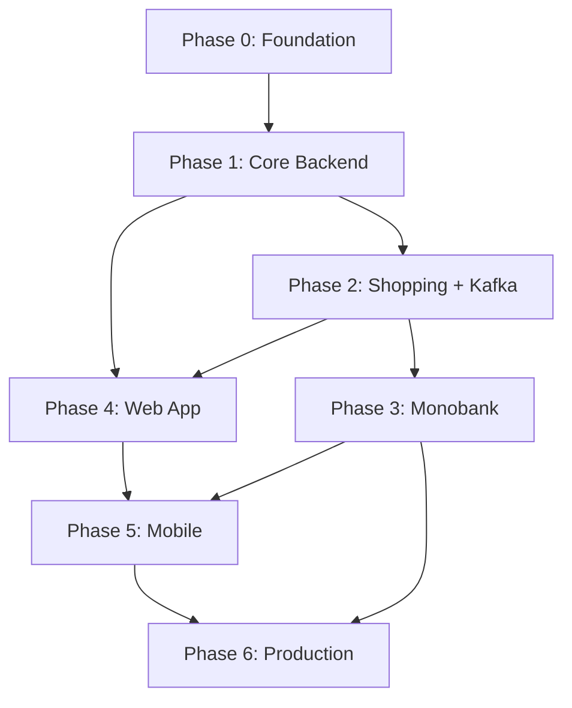

# Household — план разработки

> Комплексное приложение для учёта финансов и совместных покупок в семье/домохозяйстве.
> Цель проекта — углубление в backend, микросервисы, мобильную разработку.

---

## Содержание

1. [Видение и цели](#1-видение-и-цели)
2. [Стек технологий](#2-стек-технологий)
3. [Архитектура](#3-архитектура)
4. [Микросервисы](#4-микросервисы)
5. [Инфраструктура (Docker Compose)](#5-инфраструктура-docker-compose)
6. [Модель данных](#6-модель-данных)
7. [Kafka-события](#7-kafka-события)
8. [API — все эндпоинты](#8-api--все-эндпоинты)
9. [Фазы разработки](#9-фазы-разработки)
10. [MVP scope](#10-mvp-scope)
11. [Деплой и App Store](#11-деплой-и-app-store)
12. [Открытые вопросы](#12-открытые-вопросы)
13. [Real-time (Socket.IO)](#13-real-time-socketio)

---

## 1. Видение и цели

### Что делает приложение

| Модуль | Описание |
|--------|----------|
| **Финансы** | Накопления (наличка, банки, крипта), доходы из разных источников, расходы и подписки. В перспективе — автосинк с Monobank. |
| **Покупки** | Списки по магазинам, «где обычно покупаем» vs «купить сейчас в другом месте», история цен. |
| **Совместный доступ** | Несколько пользователей в одном пространстве: каждый вносит свои данные, видит общую картину, приглашает других. |

### Зачем микросервисы

Проект — **учебный**: цель — пройти через реальные сложности (межсервисное взаимодействие, Kafka, Redis, отдельные БД, деплой). Архитектура **microservice-ready с первого дня**, но не 10 сервисов в MVP — см. [раздел 4](#4-микросервисы).

### Порядок разработки

```
Backend → Web → Mobile → Интеграции → Деплой → App Store
```

---

## 2. Стек технологий

| Слой | Технология | Комментарий |
|------|------------|-------------|
| Backend | **NestJS + TypeScript** | Monorepo, `@nestjs/microservices` для Kafka |
| БД | **PostgreSQL** | Отдельная схема/БД на сервис (или schema-per-service) |
| Кэш / сессии | **Redis** | Refresh tokens, rate limit, invite tokens, Socket.IO adapter |
| Очереди | **Apache Kafka** | Межсервисные события; bridge → Socket.IO для real-time |
| Real-time | **Socket.IO** | Совместное редактирование, присутствие, live-обновления |
| Web | **React + Vite** | SPA за логином — SEO не нужен |
| Mobile | **React Native** | Общие типы/контракты с web через shared lib; `socket.io-client` |
| Контейнеризация | **Docker Compose** | Локально и как основа для prod |
| API docs | **Swagger** | На API Gateway |

### React vs Next.js

**Рекомендация: React (Vite), не Next.js.**

- Приложение за авторизацией — SEO не важен.
- Проще ментальная модель: один SPA ≈ один RN-клиент.
- Меньше серверной сложности на этапе обучения backend.
- Next.js имеет смысл позже, если появится публичный лендинг/блог.

---

## 3. Архитектура

```
┌──────────────────┐          ┌──────────────────┐
│    React Web     │          │  React Native    │
└────────┬─────────┘          └────────┬─────────┘
         │ HTTPS/REST                  │ HTTPS/REST
         │ WSS (Socket.IO)             │ WSS (Socket.IO)
         └────────────────┬────────────┘
                          │
             ┌────────────┴────────────┐
             │                         │
             ▼                         ▼
  ┌─────────────────────┐   ┌──────────────────────┐
  │    API Gateway      │   │  Realtime Gateway    │
  │  :3000 (REST)       │   │  :3010 (Socket.IO)   │
  │  auth guard, proxy  │   │  rooms, presence     │
  └──────────┬──────────┘   └──────────┬───────────┘
             │                         │
    ┌────────┼──────────┐    Redis Adapter (pub/sub)
    ▼        ▼          ▼              │
┌──────┐ ┌──────────┐ ┌─────────┐     │ Kafka Consumer
│ Auth │ │Household │ │ Finance │◄────┘
└──┬───┘ └────┬─────┘ └────┬────┘
   │          │             │
┌──────────┐  │   ┌─────────────┐  ┌──────────────┐
│ Shopping │  │   │ Integration │  │ Notification │
└────┬─────┘  │   └──────┬──────┘  └──────┬───────┘
     │        │           │                │
     └────────┴───────────┴────────────────┘
                          │
          ┌───────────────┼───────────────┐
          ▼               ▼               ▼
     PostgreSQL          Redis           Kafka
```

**Принципы:**

- Клиенты ходят по REST **только** через API Gateway.
- WebSocket-соединения идут **только** через Realtime Gateway (отдельный сервис).
- Сервисы общаются через **Kafka** (async) и **HTTP/gRPC** (sync, когда нужен немедленный ответ).
- Realtime Gateway **слушает Kafka** и транслирует события в Socket.IO комнаты — сервисы не знают о клиентах напрямую.
- Почти все сущности привязаны к `householdId` — мультитенантность на уровне домохозяйства.
- JWT access token (короткий) + refresh token (в Redis).
- Горизонтальное масштабирование Realtime Gateway — через `@socket.io/redis-adapter`.

---

## 4. Микросервисы

### Название «семьи» в продукте

| Вариант (UI) | Техническое имя | Плюсы |
|--------------|-----------------|-------|
| **Дом** | `household` | Нейтрально, не только про родственников |
| Семья | `family` | Понятно, но узковато |
| Пространство | `space` | Модно, но абстрактно |

**Рекомендация:** в API и коде — `household`, в UI — **«Дом»** (или «Наш дом»). Поддержка нескольких домохозяйств у одного пользователя (например, своя квартира + дача).

---

### 4.1 API Gateway

| Ответственность |
|-----------------|
| Единая точка входа REST API |
| JWT validation, проброс `userId` / `householdId` в заголовках |
| Rate limiting (Redis) |
| Маршрутизация к внутренним сервисам |
| Swagger / OpenAPI |
| CORS, request logging |

---

### 4.2 Auth Service

| Ответственность |
|-----------------|
| OAuth 2.0: Google, Apple, Facebook |
| JWT access + refresh tokens |
| Сессии в Redis |
| Профиль пользователя (`displayName`, `avatar`, `locale`) |
| Удаление аккаунта (GDPR-ready) |

> **App Store:** если есть сторонние соцлогины — **Sign in with Apple обязателен** ([Guideline 4.8](https://developer.apple.com/app-store/review/guidelines/)).

---

### 4.3 Household Service

| Ответственность |
|-----------------|
| CRUD домохозяйств («Дом») |
| Участники и роли |
| Приглашения (email / ссылка / код) |
| Переключение активного домохозяйства |
| Проверка прав доступа (делегируется другим сервисам через shared lib или sync call) |

**Роли:**

| Роль | Права |
|------|-------|
| `owner` | Всё + удаление дома, передача владения |
| `admin` | Управление участниками, настройки |
| `member` | CRUD своих и общих данных |
| `viewer` | Только чтение |

---

### 4.4 Finance Service

| Ответственность |
|-----------------|
| Счета: cash, bank, crypto, investment, deposit |
| Транзакции: income, expense, transfer, adjustment |
| Категории расходов/доходов |
| Источники дохода (зарплата, проект, дивиденды, аренда…) |
| Регулярные платежи (подписки, аренда) |
| Агрегированные балансы и отчёты |
| Привязка внешних транзакций (из Integration) к ручным |

---

### 4.5 Shopping Service

| Ответственность |
|-----------------|
| Магазины (супермаркеты, овощной, аптека…) |
| Каталог товаров с привязкой к магазинам |
| Списки покупок (активные / архивные) |
| «Предпочитаемый магазин» vs «купить сейчас в другом» |
| История цен (опционально в MVP+) |
| Отметка «куплено» с привязкой к транзакции (позже) |

---

### 4.6 Integration Service

| Ответственность |
|-----------------|
| Monobank: подключение, синк выписки, маппинг на счета |
| Webhook / polling с учётом лимитов API |
| Логи синхронизации |
| *Позже:* курсы крипты, другие банки |

**Monobank ограничения** (заложить в дизайн):

- Выписка: до **31 дня + 1 час** за запрос
- Частота: **1 раз в 60 секунд** на токен
- → Инкрементальный sync + очередь в Kafka

---

### 4.7 Notification Service

| Ответственность |
|-----------------|
| Email: приглашения, сбой синка |
| Push (FCM / APNs) — после mobile |
| In-app notifications (через Redis pub/sub или отдельная таблица) |
| Напоминания о регулярных платежах |

*Можно отложить до Phase 3 — в MVP достаточно email через Auth/Household.*

---

### 4.8 Realtime Gateway

| Ответственность |
|-----------------|
| WebSocket-сервер на базе Socket.IO (порт 3010) |
| Аутентификация WS-соединения по JWT (handshake `auth.token`) |
| Управление комнатами: `household:{householdId}` |
| Присутствие (presence): кто онлайн в домохозяйстве |
| Индикаторы редактирования: кто сейчас редактирует конкретную сущность |
| Kafka Consumer → bridge в Socket.IO комнаты |
| Горизонтальное масштабирование через `@socket.io/redis-adapter` |

> Клиенты подключаются **напрямую** к Realtime Gateway — он не проксируется через API Gateway (разные протоколы).

---

## 5. Инфраструктура (Docker Compose)

```yaml
# Сервисы приложения
api-gateway           # :3000
auth-service          # :3001
household-service     # :3002
finance-service       # :3003
shopping-service      # :3004
realtime-gateway      # :3010 (Socket.IO) — Phase 2+
integration-service   # Phase 3+
notification-service  # Phase 3+

# Инфраструктура
postgres              # 1 инстанс, schemas: auth, household, finance, shopping, integration
redis
kafka (KRaft)
adminer / pgadmin     # dev only
kafka-ui              # dev only
```

### Redis — use cases

| Ключ / паттерн | Назначение |
|----------------|------------|
| `session:{userId}` | Refresh token metadata |
| `ratelimit:{ip}` | Rate limiting |
| `invite:{token}` | Короткоживущие коды приглашений (TTL 7d) |
| `sync:lock:{connectionId}` | Блокировка повторного sync Monobank |
| `presence:{householdId}` | Hash: `userId → {name, avatar, editingEntity?, editingId?}` (TTL 90s, обновляется heartbeat) |
| `socket.io:*` | Внутренние ключи `@socket.io/redis-adapter` для синхронизации комнат между инстансами |

### Структура monorepo

```
apps/
  api-gateway/
  auth-service/
  household-service/
  finance-service/
  shopping-service/
  realtime-gateway/    # Socket.IO, Kafka consumer, presence
  integration-service/
  notification-service/

libs/
  common/          # guards, decorators, pipes, exceptions
  contracts/       # DTO, event schemas, shared types; Socket.IO event types
  database/        # migrations helpers, base entities
  kafka/           # producers, consumers, event envelope
```

---

## 6. Модель данных

> Все бизнес-таблицы (кроме `users`) содержат `household_id`.

### Auth

```
users
  id, email, display_name, avatar_url, locale, created_at

auth_providers
  id, user_id, provider (google|apple|facebook), provider_user_id

sessions
  id, user_id, refresh_token_hash, expires_at, device_info
```

### Household

```
households
  id, name, slug, created_by, created_at

household_members
  id, household_id, user_id, role, joined_at

household_invites
  id, household_id, email, token, role, expires_at, accepted_at
```

### Finance

```
accounts
  id, household_id, name, type, currency, external_id?, is_archived

account_balances          # snapshot или вычисляемое
  account_id, balance, updated_at

transactions
  id, household_id, account_id, type, amount, currency,
  category_id?, income_source_id?, description, date,
  external_id?, created_by

transaction_categories
  id, household_id, name, type (income|expense), icon, parent_id?

income_sources
  id, household_id, name, type (salary|project|dividend|rent|other)

recurring_payments
  id, household_id, name, amount, currency, category_id,
  frequency (monthly|weekly|yearly), next_due_date, account_id?
```

### Shopping

```
stores
  id, household_id, name, type (supermarket|greengrocer|pharmacy|other), address?

products
  id, household_id, name, category, unit, preferred_store_id,
  alternative_store_ids[], last_price?, notes

shopping_lists
  id, household_id, name, store_id?, status (active|completed|archived),
  created_by, created_at

shopping_list_items
  id, list_id, product_id?, name, quantity, unit,
  preferred_store_id, actual_store_id?, is_purchased, price?
```

### Integration

```
bank_connections
  id, household_id, provider (monobank), token_encrypted,
  account_mappings (json), last_sync_at, status

bank_sync_logs
  id, connection_id, started_at, finished_at, status, error?, transactions_count

external_transactions
  id, connection_id, external_id, raw_data (json), mapped_transaction_id?
```

---

## 7. Kafka-события

### Socket.IO bridge

Realtime Gateway подписывается на **все** Kafka-топики и транслирует события в Socket.IO комнату `household:{householdId}`. Сервисам не нужно ничего знать о WebSocket — они публикуют события в Kafka как обычно.

```
Finance Service → Kafka: finance.transaction.created
                         ↓
              Realtime Gateway (Kafka Consumer)
                         ↓
         socket.io room "household:abc123"  →  emit "entity:created" { entity: 'transaction', data }
                         ↓
              Web Client + Mobile Client (оба получают одновременно)
```

### Envelope (единый формат)

```typescript
{
  eventId: string;       // UUID
  eventType: string;     // domain.action
  householdId?: string;
  userId?: string;
  payload: object;
  createdAt: string;     // ISO 8601
}
```

### Каталог событий

| Событие | Producer | Consumers |
|---------|----------|-----------|
| `auth.user.created` | Auth | Household, Notification |
| `auth.user.deleted` | Auth | All |
| `household.created` | Household | — |
| `household.member.invited` | Household | Notification |
| `household.member.joined` | Household | Notification |
| `household.member.removed` | Household | Notification |
| `finance.account.created` | Finance | — |
| `finance.transaction.created` | Finance | Notification |
| `finance.transaction.updated` | Finance | — |
| `finance.recurring_payment.due` | Finance (cron) | Notification |
| `integration.monobank.sync.started` | Integration | — |
| `integration.monobank.sync.completed` | Integration | Finance |
| `integration.monobank.sync.failed` | Integration | Notification |
| `shopping.list.completed` | Shopping | Notification |
| `shopping.item.purchased` | Shopping | Finance (optional) |

---

## 8. API — все эндпоинты

> Префикс: `/api/v1`. Все эндпоинты ниже — через **API Gateway**.
> Заголовок `X-Household-Id` — активное домохозяйство (кроме auth и списка домов).

---

### Auth `/auth`

| Method | Path | Описание |
|--------|------|----------|
| POST | `/auth/google` | OAuth callback / token exchange |
| POST | `/auth/apple` | Sign in with Apple |
| POST | `/auth/facebook` | Facebook OAuth |
| POST | `/auth/refresh` | Обновление access token |
| POST | `/auth/logout` | Инвалидация refresh token |
| GET | `/auth/me` | Текущий пользователь + профиль |
| PATCH | `/auth/me` | Обновление профиля |
| DELETE | `/auth/me` | Удаление аккаунта |

---

### Households `/households`

| Method | Path | Описание |
|--------|------|----------|
| POST | `/households` | Создать дом |
| GET | `/households` | Список домов пользователя |
| GET | `/households/:id` | Детали дома |
| PATCH | `/households/:id` | Переименовать, настройки |
| DELETE | `/households/:id` | Удалить (только owner) |
| POST | `/households/:id/invites` | Пригласить по email |
| GET | `/households/:id/invites` | Активные приглашения |
| DELETE | `/households/:id/invites/:inviteId` | Отозвать приглашение |
| GET | `/households/:id/members` | Участники |
| PATCH | `/households/:id/members/:memberId` | Сменить роль |
| DELETE | `/households/:id/members/:memberId` | Удалить участника |
| POST | `/invites/:token/accept` | Принять приглашение |

---

### Finance — Accounts `/accounts`

| Method | Path | Описание |
|--------|------|----------|
| POST | `/accounts` | Создать счёт |
| GET | `/accounts` | Список счетов дома |
| GET | `/accounts/:id` | Детали + баланс |
| PATCH | `/accounts/:id` | Обновить |
| DELETE | `/accounts/:id` | Архивировать / удалить |
| GET | `/accounts/:id/balance` | Текущий баланс |
| GET | `/accounts/summary` | Сводка по всем счетам |

---

### Finance — Transactions `/transactions`

| Method | Path | Описание |
|--------|------|----------|
| POST | `/transactions` | Создать транзакцию |
| GET | `/transactions` | Список (фильтры: date, type, account, category) |
| GET | `/transactions/:id` | Детали |
| PATCH | `/transactions/:id` | Обновить |
| DELETE | `/transactions/:id` | Удалить |
| POST | `/transactions/transfer` | Перевод между счетами |

---

### Finance — Categories `/categories`

| Method | Path | Описание |
|--------|------|----------|
| POST | `/categories` | Создать категорию |
| GET | `/categories` | Список (income / expense) |
| PATCH | `/categories/:id` | Обновить |
| DELETE | `/categories/:id` | Удалить |

---

### Finance — Income Sources `/income-sources`

| Method | Path | Описание |
|--------|------|----------|
| POST | `/income-sources` | Создать источник |
| GET | `/income-sources` | Список |
| PATCH | `/income-sources/:id` | Обновить |
| DELETE | `/income-sources/:id` | Удалить |

---

### Finance — Recurring Payments `/recurring-payments`

| Method | Path | Описание |
|--------|------|----------|
| POST | `/recurring-payments` | Создать подписку / аренду |
| GET | `/recurring-payments` | Список |
| GET | `/recurring-payments/:id` | Детали |
| PATCH | `/recurring-payments/:id` | Обновить |
| DELETE | `/recurring-payments/:id` | Удалить |
| GET | `/recurring-payments/upcoming` | Ближайшие платежи |

---

### Finance — Reports `/reports` *(Phase 2)*

| Method | Path | Описание |
|--------|------|----------|
| GET | `/reports/monthly` | Доходы / расходы за месяц |
| GET | `/reports/by-category` | Разбивка по категориям |
| GET | `/reports/net-worth` | Общий капитал |

---

### Shopping — Stores `/stores`

| Method | Path | Описание |
|--------|------|----------|
| POST | `/stores` | Добавить магазин |
| GET | `/stores` | Список магазинов дома |
| PATCH | `/stores/:id` | Обновить |
| DELETE | `/stores/:id` | Удалить |

---

### Shopping — Products `/products`

| Method | Path | Описание |
|--------|------|----------|
| POST | `/products` | Добавить товар в каталог |
| GET | `/products` | Каталог (поиск, фильтр по магазину) |
| GET | `/products/:id` | Детали + история цен |
| PATCH | `/products/:id` | Обновить |
| DELETE | `/products/:id` | Удалить |

---

### Shopping — Lists `/shopping-lists`

| Method | Path | Описание |
|--------|------|----------|
| POST | `/shopping-lists` | Создать список |
| GET | `/shopping-lists` | Списки (active / archived) |
| GET | `/shopping-lists/:id` | Детали с items |
| PATCH | `/shopping-lists/:id` | Обновить (название, магазин, статус) |
| DELETE | `/shopping-lists/:id` | Удалить |
| POST | `/shopping-lists/:id/items` | Добавить позицию |
| PATCH | `/shopping-lists/:id/items/:itemId` | Обновить (qty, store, purchased) |
| DELETE | `/shopping-lists/:id/items/:itemId` | Удалить позицию |
| POST | `/shopping-lists/:id/complete` | Завершить список |

---

### Shopping — Smart suggestions `/shopping-lists/suggest` *(Phase 2)*

| Method | Path | Описание |
|--------|------|----------|
| POST | `/shopping-lists/suggest` | Сгенерировать список из каталога по выбранному магазину |

---

### Integration — Bank `/integrations/bank`

| Method | Path | Описание |
|--------|------|----------|
| POST | `/integrations/monobank/connect` | Подключить Monobank (token) |
| GET | `/integrations/monobank/connections` | Список подключений |
| DELETE | `/integrations/monobank/connections/:id` | Отключить |
| POST | `/integrations/monobank/connections/:id/sync` | Запустить синк вручную |
| GET | `/integrations/monobank/connections/:id/logs` | История синков |
| GET | `/integrations/monobank/transactions` | Несмэпленные внешние транзакции |
| POST | `/integrations/monobank/transactions/:id/map` | Привязать к счёту/категории |

---

### System

| Method | Path | Описание |
|--------|------|----------|
| GET | `/health` | Health check всех сервисов |
| GET | `/docs` | Swagger UI |

---

## 9. Фазы разработки

### Phase 0 — Foundation (1–2 недели)

```
□ Git repo + NestJS monorepo (Nx или native workspaces)
□ Docker Compose: postgres, redis, kafka, adminer, kafka-ui
□ libs/common: config, logger, exception filter, response format
□ libs/contracts: базовые DTO и event envelope
□ libs/database: migration runner (TypeORM / Prisma — выбрать)
□ API Gateway skeleton + /health
□ Единый формат ошибок { statusCode, message, error, timestamp }
□ Swagger setup
```

---

### Phase 1 — Core Backend MVP (3–4 недели)

```
□ Auth Service
    □ Google OAuth (первым — проще всего)
    □ JWT access/refresh + Redis sessions
    □ GET/PATCH /auth/me
    □ Kafka: auth.user.created

□ Household Service
    □ CRUD households
    □ Members + roles
    □ Invites (token в Redis, email позже)
    □ Kafka: household.*

□ Finance Service (без банка)
    □ Accounts CRUD
    □ Transactions CRUD + transfer
    □ Categories, income sources
    □ Recurring payments (без cron напоминаний)
    □ Kafka: finance.transaction.created

□ API Gateway
    □ Auth guard на всех роутах
    □ Проксирование к сервисам
    □ X-Household-Id middleware
```

**Результат Phase 1:** можно тестировать весь finance flow через Swagger.

---

### Правило тестирования (Phase 2+)

Начиная с Phase 2, каждый завершённый feature issue должен иметь:

1. **Интеграционные тесты** — `apps/<service>/test/*.integration.spec.ts` покрывают happy path, граничные случаи и Kafka assertions.
2. **Issue в milestone Testing** с Postman-чеклистом для ручного E2E.

**Технический стек:**
- Авто-тесты: `jest` + `supertest` + `@household/testing` (фабрика приложения, cleaner БД, mock Kafka)
- Ручное тестирование: Postman — коллекция в `docs/postman/`
- Swagger — только справочник эндпоинтов во время разработки

**Запуск:**
```bash
# Требует: docker compose up -d  (postgres + redis, БД household_test создаётся автоматически)
pnpm --filter @household/finance-service test:integration   # один сервис
pnpm test:integration                                       # все сервисы
```

**Образец** (паттерн для всех Phase 2+ сервисов): `apps/finance-service/test/`

---

### Phase 2 — Shopping + Real-time (2–3 недели)

```
□ Shopping Service
    □ Stores, Products, Shopping Lists
    □ preferredStore vs actualStore логика
    □ Kafka: shopping.list.completed

□ Kafka consumers между сервисами
□ Redis rate limiting на Gateway
□ Finance reports (monthly, by-category)
□ Shopping suggest endpoint
```

---

### Phase 3 — Integrations + Migrations (2–3 недели)

```
□ Integration Service
    □ Monobank connect + sync
    □ Incremental sync с учётом лимитов
    □ Маппинг external → internal transactions
    □ Kafka: integration.monobank.*

□ Apple + Facebook OAuth (для App Store)

□ TypeORM migrations (схема стабилизировалась после Phase 2)
    □ Сгенерировать initial migration для каждого сервиса:
        pnpm --filter @household/auth-service migration:generate -- -n InitAuth
        pnpm --filter @household/household-service migration:generate -- -n InitHousehold
        pnpm --filter @household/finance-service migration:generate -- -n InitFinance
        pnpm --filter @household/shopping-service migration:generate -- -n InitShopping
        pnpm --filter @household/integration-service migration:generate -- -n InitIntegration
    □ Проверить что migrations: run создаёт схему корректно на чистой БД
    □ Отключить synchronize: true в development (заменить на migrations: run в ensureSchema)
    □ Добавить migration:run в docker-compose healthcheck или startup script
```

---

### Phase 4 — Web App ✅ (завершено)

```
□ React + Vite + TypeScript
□ React Query (TanStack Query) для API
□ Auth flow (OAuth redirect / popup)
□ Layout: sidebar, household switcher
□ Страницы:
    □ Dashboard (балансы, ближайшие платежи)
    □ Accounts & Transactions
    □ Categories & Income sources
    □ Shopping lists
    □ Household settings & invites
    □ Bank connections (Monobank)
□ Shared types из libs/contracts (npm link или copy)
□ Socket.IO клиент (socket.io-client)
    □ Подключение при логине, отключение при логауте
    □ Live-обновления списков при изменениях других участников
    □ Индикаторы "кто онлайн" в шапке / sidebar
    □ Индикатор "редактирует..." на транзакциях и shopping items
```

---

### Phase 5 — Mobile (4–6 недель)

```
□ React Native (Expo — быстрее старт)
□ Те же экраны что web (адаптивно)
□ Secure storage для tokens (expo-secure-store)
□ Push notifications setup (FCM + APNs)
□ Deep links для invite accept
□ Socket.IO клиент (тот же socket.io-client работает в RN)
    □ Те же события что и web — единый контракт из libs/contracts
    □ Reconnect при выходе из фона (AppState listener)
```

---

### Phase 6 — Production (2–3 недели)

```
□ Notification Service (email + push)
□ Recurring payment cron + reminders
□ CI/CD (GitHub Actions)
    □ lint + test:integration + build на каждый PR
    □ migration:run как часть deploy pipeline

□ Миграции в production
    □ synchronize: false во всех сервисах (убрать из кода, не только env)
    □ migration:run запускается до старта каждого сервиса (CMD в Dockerfile)
    □ Убедиться что rollback-стратегия понятна (down migrations)

□ Деплой backend (Railway / Fly.io / VPS + Docker)
□ Деплой web (Vercel / Cloudflare Pages — статика)

□ Мониторинг — Sentry
    □ @sentry/nestjs в каждом NestJS сервисе
        □ SentryModule.forRoot({ dsn, environment, release })
        □ SentryInterceptor для захвата unhandled exceptions
        □ Трассировка входящих HTTP запросов (tracesSampleRate)
    □ @sentry/react в web-приложении
        □ Sentry.init() в main.tsx
        □ ErrorBoundary компонент для React-дерева
    □ @sentry/react-native в mobile
        □ Sentry.init() в App.tsx
        □ Native crash reporting

□ App Store submission
```

---

## 10. MVP scope

**Входит в первый релиз:**

- [x] Auth (Google + Apple)
- [x] Household (создание, приглашения, роли)
- [x] Accounts + ручные транзакции
- [x] Категории и источники дохода
- [x] Регулярные платежи (без push-напоминаний)
- [x] Shopping lists + stores + products
- [x] Web dashboard
- [x] Docker Compose + Swagger
- [x] Real-time: live-обновления данных между участниками домохозяйства
- [x] Real-time: presence (кто онлайн) + индикаторы редактирования

**Не входит в MVP (backlog):**

- Monobank auto-sync
- Крипто-курсы
- Отчёты и графики
- Push notifications
- Mobile app
- Мультивалютность с конвертацией
- Привязка покупки к транзакции

---

## 11. Деплой и App Store

### Backend

| Вариант | Плюсы | Минусы |
|---------|-------|--------|
| **Railway / Render** | Просто, Docker-native | Дороже при росте |
| **Fly.io** | Edge, хорош для EU | Чуть сложнее |
| **VPS (Hetzner)** | Дёшево, полный контроль | Админка на тебе |

Рекомендация для старта: **Railway** или **Fly.io** — меньше DevOps, фокус на коде.

### Web

Статический SPA → **Cloudflare Pages** или **Vercel** (бесплатный tier).

### Mobile → App Store

1. Apple Developer Account ($99/год)
2. Sign in with Apple — обязателен
3. Privacy Policy URL — обязателен
4. EAS Build (Expo) для сборки
5. TestFlight → Review

### Env variables (prod)

```
DATABASE_URL, REDIS_URL, KAFKA_BROKERS
JWT_SECRET, JWT_REFRESH_SECRET
GOOGLE_CLIENT_ID, GOOGLE_CLIENT_SECRET
APPLE_CLIENT_ID, APPLE_TEAM_ID, APPLE_KEY_ID
FACEBOOK_APP_ID, FACEBOOK_APP_SECRET
MONOBANK_WEBHOOK_SECRET (если будет)
ENCRYPTION_KEY (для bank tokens)
```

---

## 12. Открытые вопросы

Ответы на эти вопросы повлияют на детали реализации. Можно решить по ходу, но лучше до Phase 1.

### Продукт

1. **Один пользователь — несколько домов?** (своя квартира + родители) — рекомендую **да**.
2. **Мультивалютность?** UAH + USD + EUR + crypto — нужна ли конвертация в базовую валюту дома?
3. **Крипта:** только ручной ввод баланса или трекинг по адресу кошелька?
4. **Транзакции:** общие на дом или у каждого участника «личные» + «общие»?
5. **Shopping:** один активный список или несколько параллельных (по магазинам)?

### Технические

6. **ORM:** TypeORM (нативно в Nest) vs Prisma (лучше DX) — что ближе?
7. **Monorepo tool:** Nx vs Nest CLI workspaces vs Turborepo?
8. **Межсервисные sync-вызовы:** HTTP REST vs gRPC?
9. **Одна БД postgres с schemas** vs отдельные БД на сервис — для обучения рекомендую **schemas** (проще локально).
10. **Язык UI:** только украинский, русский, английский или i18n с первого дня?

### Бизнес / legal

11. **Monobank:** личный токен или OAuth flow для пользователей?
12. **Хранение bank tokens:** encryption at rest — libsodium / AWS KMS?
13. **GDPR:** пользователь из EU — нужна политика удаления данных (заложено в `DELETE /auth/me`).

---

## 13. Real-time (Socket.IO)

### Концепция

Один пользователь может одновременно работать с приложением на web и mobile. В рамках одного домохозяйства несколько участников должны видеть изменения друг друга мгновенно — без перезагрузки страницы. Для этого выделен отдельный сервис **Realtime Gateway**.

### Сервис: `realtime-gateway` (порт 3010)

**Стек:** NestJS + `@nestjs/platform-socket.io` + `@socket.io/redis-adapter` + KafkaJS.

**Аутентификация при подключении:**

```typescript
// Клиент передаёт JWT при handshake
const socket = io('wss://api.example.com:3010', {
  auth: { token: '<access_token>' }
});

// Сервер валидирует в middleware подключения
io.use((socket, next) => {
  const token = socket.handshake.auth.token;
  // verify JWT → socket.data.userId, socket.data.householdIds
});
```

После аутентификации сервер **автоматически** подписывает клиента на комнаты всех его домохозяйств:

```
household:{householdId}   — основная комната для всех событий дома
```

### Комнаты и namespace

| Комната | Когда использовать |
|---------|-------------------|
| `household:{id}` | Все события домохозяйства (транзакции, список покупок, участники) |
| `shopping-list:{id}` | Детальные события конкретного списка (пометка товара куплено) — sub-room |

Sub-room присоединяется когда пользователь **открывает** конкретный экран, покидает при уходе.

### События: клиент → сервер

| Событие | Payload | Описание |
|---------|---------|----------|
| `presence:heartbeat` | `{ householdId }` | Каждые 30 с — подтверждение онлайн-статуса |
| `editing:start` | `{ householdId, entity, entityId }` | Пользователь открыл форму редактирования |
| `editing:stop` | `{ householdId, entity, entityId }` | Сохранил / закрыл форму |
| `room:join` | `{ roomName }` | Войти в sub-room (напр. при открытии списка покупок) |
| `room:leave` | `{ roomName }` | Покинуть sub-room |

### События: сервер → клиент

| Событие | Payload | Источник |
|---------|---------|---------|
| `presence:snapshot` | `{ users: PresenceUser[] }` | При подключении — текущий список онлайн |
| `presence:update` | `{ userId, status: 'online'\|'offline', editing? }` | Изменение присутствия |
| `entity:created` | `{ entity, householdId, data }` | Kafka → bridge |
| `entity:updated` | `{ entity, householdId, entityId, data }` | Kafka → bridge |
| `entity:deleted` | `{ entity, householdId, entityId }` | Kafka → bridge |
| `error` | `{ message }` | Auth fail, invalid room |

### Маппинг Kafka-событий → Socket.IO

```typescript
// В realtime-gateway/src/kafka/realtime-bridge.service.ts
const KAFKA_TO_SOCKET: Record<string, { entity: string; socketEvent: string }> = {
  'finance.transaction.created':  { entity: 'transaction',    socketEvent: 'entity:created' },
  'finance.transaction.updated':  { entity: 'transaction',    socketEvent: 'entity:updated' },
  'finance.account.created':      { entity: 'account',        socketEvent: 'entity:created' },
  'shopping.list.completed':      { entity: 'shoppingList',   socketEvent: 'entity:updated' },
  'shopping.item.purchased':      { entity: 'shoppingItem',   socketEvent: 'entity:updated' },
  'household.member.joined':      { entity: 'member',         socketEvent: 'entity:created' },
  'household.member.removed':     { entity: 'member',         socketEvent: 'entity:deleted' },
};

// При получении события из Kafka:
// io.to(`household:${event.householdId}`).emit(socketEvent, { entity, data: event.payload })
```

### Presence — хранение в Redis

```
presence:{householdId}   → Redis Hash
  field: userId
  value: JSON { displayName, avatarUrl, connectedAt, editingEntity?, editingId? }
  TTL: обновляется каждые 30 с heartbeat-ом, истекает через 90 с
```

При `editing:start` сервер обновляет поле юзера в хэше и бродкастит `presence:update` в комнату.
При `editing:stop` или disconnect — очищает `editingEntity` / помечает offline.

### Поведение при multi-device

Один пользователь открыл web и mobile одновременно:
- Оба сокета регистрируются с одним `userId`
- Presence хранится по `userId`, не по `socketId` — в комнате он виден как **один** онлайн-пользователь
- При disconnect одного девайса — проверяем, есть ли другие активные сокеты этого `userId` (через Redis), и только тогда помечаем offline

### Типы (в `libs/contracts`)

```typescript
// libs/contracts/src/realtime/events.ts
export interface PresenceUser {
  userId: string;
  displayName: string;
  avatarUrl?: string;
  editingEntity?: string;  // 'transaction' | 'shoppingItem' | ...
  editingId?: string;
}

export interface EntityEvent<T = unknown> {
  entity: string;
  householdId: string;
  entityId?: string;
  data?: T;
}
```

### Клиентская интеграция

**Web (React):**
```typescript
// Singleton socket, инициализируется после логина
// Используется React Context или Zustand store для presence state
// TanStack Query invalidation при entity:created/updated/deleted
queryClient.invalidateQueries({ queryKey: ['transactions', householdId] });
```

**Mobile (React Native):**
```typescript
// Тот же socket.io-client
// AppState.addEventListener('change', state => {
//   if (state === 'active') socket.connect();
//   if (state === 'background') socket.disconnect();
// })
```

### Горизонтальное масштабирование

```typescript
// realtime-gateway/src/main.ts
import { createAdapter } from '@socket.io/redis-adapter';
import { createClient } from 'ioredis';

const pubClient = createClient({ host: REDIS_HOST });
const subClient = pubClient.duplicate();
io.adapter(createAdapter(pubClient, subClient));
```

Несколько инстансов Realtime Gateway синхронизируют комнаты через Redis — клиент может попасть на любой инстанс.

---

## Диаграмма зависимостей фаз



---

*Последнее обновление: август 2026*
